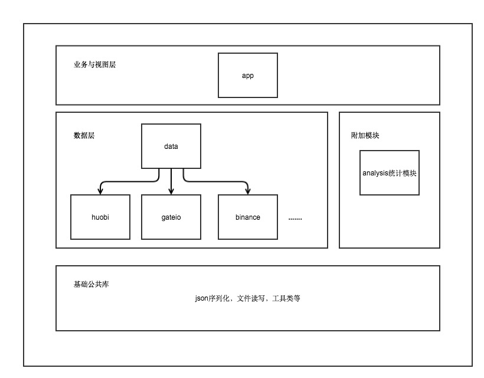

fafabtc
=================
主要功能为区块链资产行情查看与实盘模拟，通过建立不同的资产组合，可以根据市场行情计算实际资产市值，也可以用于模拟交易，对资产组合进行验证。

 |  | 
---------|--------|----------
## 项目结构

## 测试
各个交易所模块下java单元测试可以进行api调用的测试：
```java
public class GateioApiTest {

    GateioApi api;

    @Before
    public void init() {
        api = GateioHttpClient.api();
    }

    @Test
    public void testMarketInfo() {
        api.marketInfo().subscribe(new SingleObserver<JsonObject>() {
            @Override
            public void onSubscribe(Disposable d) {

            }

            @Override
            public void onSuccess(JsonObject jsonObject) {
                System.out.println(jsonObject.toString());
            }

            @Override
            public void onError(Throwable e) {
                e.printStackTrace();
            }
        });
    }

    // ...
}
```

## 事件
- 2018-03-13 15:38:26 +0800 貌似最近知名交易所都被墙了，之前的api已经不能正常访问，需要使用梯子才行。

    当前行情：BTC 9000$ ETH 700$

- 2018-03-29 22:11:37 +0800 最近ico没那么火了，ETH又跌了大半

    当前行情：BTC 7400$ ETH 400$

- 2018-04-14 15:21:32 +0800 前两日行情似乎回暖，若干山寨币大涨

    当前行情：BTC 7990$ ETH 502$

- 2018-06-11 23:17:02 +0800 最近又瀑布了，就是这样

    当前行情：BTC 6707$ ETH 520$
